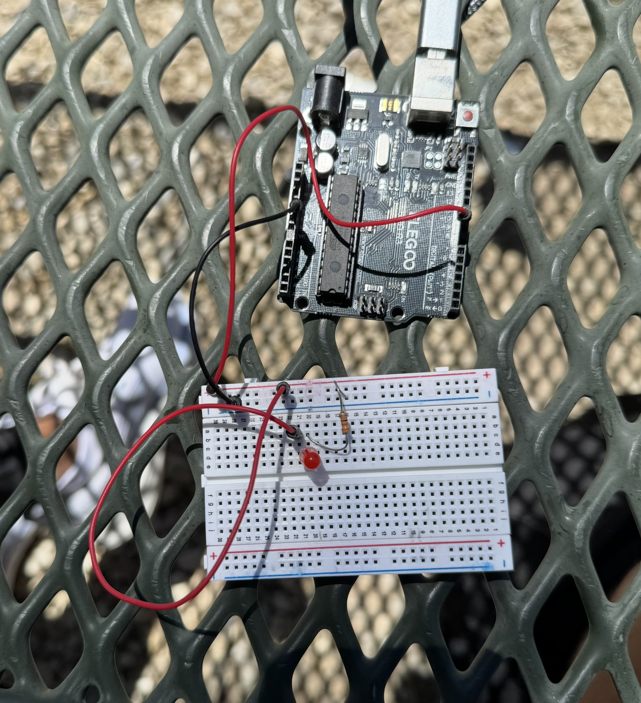
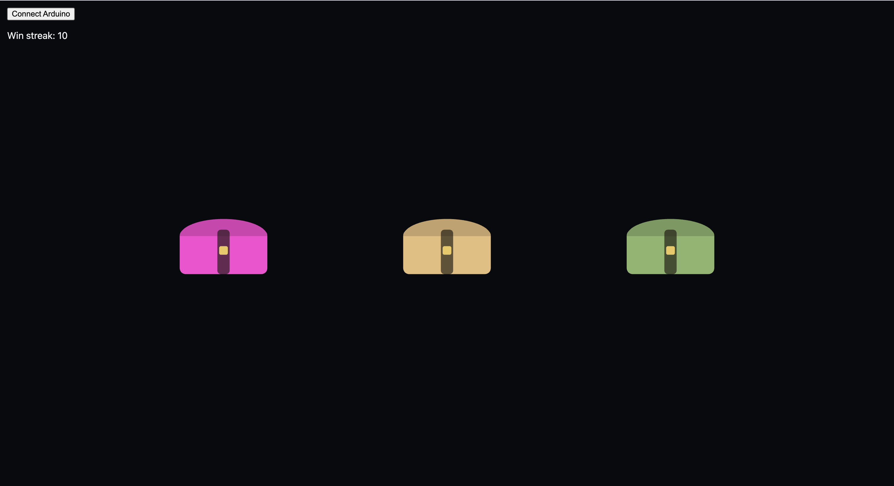

# Glow Treasure Hunt

_By Adam Hacker_

> Find the treasure by letting the light guide you!

---

## Showcase / Description of Finished Piece

This is an interactive piece that connects an on-screen game with a physical LED light. Three treasure chests are placed on the screen, each set to a random color. One of them (which is chosen randomly each round) is the "correct" chest, but the screen gives absolutely nohing away. The clue actually lives in the real world!

A single LED, which is wired to an Arduino, acts as a "hot and cold" guide. As the cursor is moved across the screen, the LED gets brighter the closer you get to the correct chest, and fades to darkness as you drift away. The game then becomes a hunt between two things at once: your eyes on the screen, and your attention on the glow from the LED below it.

Once you are confident in what the correct chest is, you click the chest. If you're correct, the win streak increments by 1! If you're wrong, the streat resets back to zero. Either way, a fresh round then begins instantly with new chests and the treasure rehidden.

**Key features:**

- Three procedurally colored treasure chests, redrawn fresh every round
- A physical LED guide driven over Web Serial. The brightness scales with cursor proximity to the hidden chest
- Smooth, eased proximity falloff so the light feels like a gentle "warmer / colder" hint rather than an on/off switch
- A persistent win streak that rewards a run of correct guesses and punishes a miss
- Throttled serial output (~20 messages/sec) to keep the Arduino responsive without flooding the connection
- Responsive full-window canvas that re-lays-out the chests on any screen size

---

## Process

### Ideation / Design Process

This project, as part of DESINV 23, was required to make something "glow". I started by wondering in what capacity I wanted to incorporate an LED, and what purpose I wanted it to serve.

That's when I started to draw inspiration from arcade games. In most games, external devices (such as LEDs) serve as an "indicator". They give you reinforcement of information that's already presented on the screen.

However, with this project, I wondering if I could decouple the two. That is, I wanted the LED to give vital information that was not available on the screen. To carry out this idea, I created a "treasure hunt" game. I wanted to have users select the "correct" chest, but the information would be with the LED rather than anything on the screen itself.

### Prototyping / Building Process

The project is a small, self-contained web piece built with **p5.js** for rendering and the browser's **Web Serial API** (via the makeabilitylab `serial.js` helper) for talking to the hardware. The physical side is an **Arduino** with a single LED on a PWM pin.

The screen-side logic is pretty simple. Each round picks a random `correctIndex` among the three chests and assigns every chest a random color, so nothing visually distinguishes the winner. Clicking a chest checks it against `correctIndex`, updates the streak, and immediately starts a new round.

What is likely more interesting is the bridge to the hardware. On every frame, the sketch measures the distance from the cursor to the correct chest and converts it into a brightness value:

- Distance is compared against an _influence radius_ (a bit larger than the chest itself).
- That ratio is inverted (closer means a higher value) and clamped to a 1 range.
- The value is then _eased_ (squared) so the glow ramps up gently near the target instead of jumping.
- The result is scaled to 0-255 and sent to the Arduino as a line of text.

Only the _correct_ chest contributes any light. Hovering near a wrong chest leaves the LED dark, so the player can't simply sweep the screen and watch for any reaction. They have to find the one spot that makes the world brighter.

To keep the serial connection healthy, messages are throttled: a new brightness value is only sent if enough time has passed or the value actually changed. On the Arduino side, a tiny sketch reads complete lines, clamps the number to a valid byte, and writes it straight to the LED with `analogWrite`.

The above photo shows the wiring.

There were a few small iterations to the software side, but most were based on aesthetics. One change that occurred halfway through development was the idea of having each chest assigned a random color. This furthers the importance of the LED as the sole providor of "truth" on which chest is correct.

The snapshot above showcases the final version of the user interface. As you can see, each chest has a random color. The chests also have a "hover" effect that scales the chest by a small size when the cursor hovers over it.

<video src="https://github.com/user-attachments/assets/652be4a5-b6a1-46ec-974d-a24022f38f83" width="80%" controls></video>

Above, there is a video showcasing the "glow" effect live!

---

## Conclusion / Reflection

This was yet again another super fun project! I learned a lot about connecting hardware and software to create one larger project. I think the framing of "What can an LED provide that a screen can't" (in this case, it was the "answer" for the correct chest) was a good mental framing.

One thing I learned was definitely to think small and then grow as you go along. At first, I was trying to create a much more complex video game. Eventually, I realized starting at such a large scale lost much of the meaning behind the piece.

By keeping it small and growing as needed, I was able to keep the core focus of the LED in the spotlight.

---

## Hardware Setup

You'll need:

- An Arduino (Uno or similar)
- One LED + an appropriate resistor

Wiring:

- LED anode (long leg) → a resistor → digital pin **D9** (PWM)
- LED cathode (short leg) → **GND**

Upload [`glow-treasure-hunt.ino`](glow-treasure-hunt.ino) to the board before connecting.

---

## Running the Project

The Web Serial API requires the page to be served over `http://localhost` (or HTTPS) -- opening the HTML file directly will not work.

1. From the project folder, start a local server, e.g. `python3 -m http.server 8000`
2. Open **http://localhost:8000** in **Chrome or Edge** (Web Serial is not supported in Firefox or Safari).
3. Click **Connect Arduino** and select your board's serial port.
4. Move your cursor to hunt for the treasure -- watch the LED.

---

## Controls

- **Move the mouse** — hunt for the treasure; the LED brightens as you near the hidden chest
- **Click a chest** — make your guess (correct guess grows your streak, a miss resets it)
- **Connect Arduino** button — open the Web Serial connection to the board
